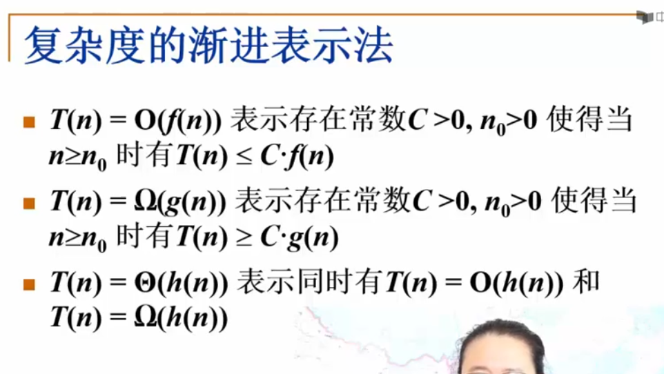
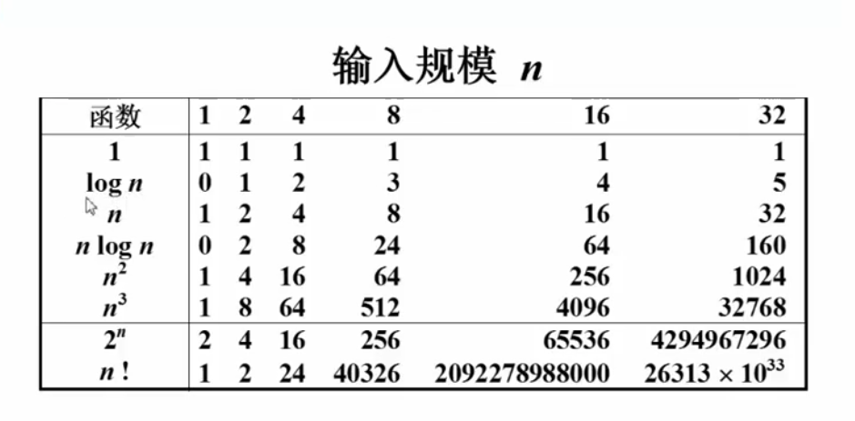

[TOC]
# 算法
## 一个有限的指令集
## 接收一些输出（有些情况下不需要输出）
## 产生输出
## 一定在有限步骤之后终止
## 每一条指令必须
### 有充分的明确的目标，不可以有歧义
### 计算机能处理的范围之内
### 描述应不依赖任何一种计算机语言以及具体的实现
***
# 例一:选择排序算法伪码描述
> void SelsectionSort(int List[],int N)
>{/*将N个整数List[0]...List[N-1]进行非递减排序*/
>   for(i=0;i<N;i++){
>       从List[i]到List[N-1]中找出最小元，并将其位置赋给MinPosition
>       将未排序部分最小元换到有序部分的最后部分
>       }
>}
*****

# 什么是好的算法
* 空间复杂度S(n)--根据算法写成程序在执行时占用存储单元的长度
* 时间复杂度T(n)--根据算法写成程序在执行时耗费时间的长度
** 最坏情况复杂度Tworst(n);
** 平均复杂度Tavg(n);
**  Tavg(n)<Tworst(n)

*****

# 复杂度渐进表示法
T(n)=O(f(n))表示存在常数C>0,n0>0~~

