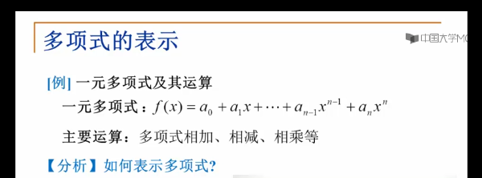

# 多项式的表示
### 分析问题的关键数据、关键信息
#### 多项式的关键数据
* 多项式项数n
* 各项系数ai及指数i

>方法1：书序存储结构直接表示
* 数组个分量对应多项式各项
* a[i]:项xi的系数ai
* 例如：f(x)=4x5-3x2+1
[Alt text](imgs/书序存储结构直接表示.png)

>方法2：顺序存储结构表示非零项
* 每个非零项aixi涉及两个信息：系数ai和指数i
* 可以将一个多项式看成一个（ai,i）二元组的集合
* 用结构数组表示：数组分量是由系数ai、指数i组成的结构对应一个非零项(按照指数大小排序）
[Alt text](imgs/顺序存储结构表示非零项.png)
[Alt text](imgs/顺序存储结构表示非零项1.png)

>方法三：链表结构存储非零项
* 链表中每个结构存储多项中的一个非零项，包括系数和指数两个数据与以及一个指针域
[Alt text](imgs/链表结构存储非零项.png)

&& 1、同一问题可以有不同的表示（存储）方法
&& 2、有一类共性问题：有序线性序列的组织和管理
### “线性表（Linear List）”:右同类数据元素构成有序序列的线性结构
* 表中元素称为线性表的长度
* 线性表没有元素时，称为空表
* 表的起始位置称为表头，表结束位置称为表尾

> 类型名称：线性表（List）
> 数据对象集：线性表是n（>=0）个元素构成的有序序列（a1,a2,......,an）
> 操作集：线性表L《 List,整数i表示位置，元素X《ElementType,线性表基本操作主要有：
[Alt text](imgs/线性表基本操作.png)

## 线性的书序存储实现：利用数组的连续存储空间顺序存放线性表的各元素
